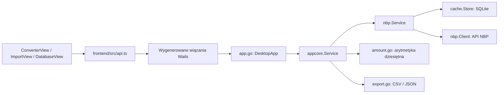

# Mapa Kursomatu

Mapa po weryfikacji i poprawkach z 2026-09-16. Punktem odniesienia są źródła; graf AST pomaga nawigować, ale nie odtwarza wszystkich wywołań dynamicznych ani granicy Wails.

| Obszar | Pliki | Odpowiedzialność |
| --- | --- | --- |
| Uruchomienie | `main.go`, `app.go` | Okno Wails, adapter metod, cykl życia i anulowanie importu |
| Przypadki użycia | `internal/appcore/service.go` | Konwersja, import, historia, przełączanie backendu |
| Kwoty | `internal/appcore/amount.go`, `frontend/src/conversion.ts` | Parsowanie zapisu dziesiętnego, działania i zaokrąglanie |
| Daty i walidacja | `internal/appcore/validate.go`, `internal/models/rate.go`, `date.go` | Format i zakres dat, kalendarz NBP, zgodność kodu i kursu |
| Notowania | `internal/nbp/client.go`, `service.go` | HTTP/retry, okna maksymalnie 93 dni, wybór najnowszego kursu, polityka cache |
| Dane lokalne | `internal/cache/store.go` | Transakcje SQLite, historia, zweryfikowane mapowania zapytań |
| Ustawienia i eksport | `internal/appcore/config.go`, `export.go` | Pliki konfiguracji, zmienne środowiskowe, CSV i JSON |
| Interfejs | `frontend/src/views`, `components` | Formularze, wyniki, historia, import, ustawienia |
| Regresje | `internal/**/*_test.go`, `frontend/tests` | Walidacja, obliczenia, cache, integracja i zachowanie formularza |

## Przepływ konwersji

1. Formularz przyjmuje nieujemną kwotę dziesiętną z przecinkiem albo kropką. Pusty tekst, notacja szesnastkowa, wykładnicza i niejednoznaczne separatory są odrzucane.
2. `Service.Convert` weryfikuje kwotę, walutę, kierunek i datę od początku archiwum NBP do bieżącej daty w Warszawie.
3. `nbp.Service` używa poprawnego kursu z dokładnie żądanego dnia albo wcześniej zweryfikowanego przypisania do wcześniejszego notowania. Sam starszy rekord nie dowodzi braku późniejszych publikacji.
4. Klient NBP weryfikuje tabelę, walutę, daty, zakres, duplikaty i dodatniość kursów. Długie wyszukiwanie przebiega od najnowszego okna wstecz.
5. Kurs i przypisanie są zapisywane transakcyjnie. Przypisanie dzisiejszej daty do wcześniejszego kursu pozostaje tymczasowe; nie staje się trwałe po północy.
6. PLN → waluta dzieli przez `mid`; waluta → PLN mnoży przez `mid`. Arytmetyka na dziesiętnej reprezentacji danych wejściowych zaokrągla wynik raz, do czterech miejsc, z połowami w górę.
7. Interfejs usuwa wynik po zmianie parametrów i ignoruje odpowiedzi wcześniejszych żądań.

## Narzędzia mapowania

- `context-mode`: indeksowanie źródeł, analiza wyników testów i wyszukiwanie ustaleń.
- `graphify-out/graph.json`, `GRAPH_REPORT.md`, `graph.html`: lokalny graf kodu, 537 węzłów, 950 krawędzi, 23 grupy. Graf obejmuje też konfigurację, testy i generowane wiązania; dokumenty i lokalne bazy nie były analizowane semantycznie. Katalog jest ignorowany przez Git zgodnie z istniejącą konfiguracją.
- Serena: przygotowano `.serena/project.yml` dla Go i TypeScript. Indeksowanie nie zakończyło się powodzeniem: brak `gopls` oraz błąd pobrania zależności TypeScript. Nie używano nieistniejącego indeksu do wnioskowania o poprawności.

Instrukcje dalszej pracy: [AGENTS.md](../AGENTS.md). Wyniki kontroli: [VERIFICATION.md](VERIFICATION.md).
